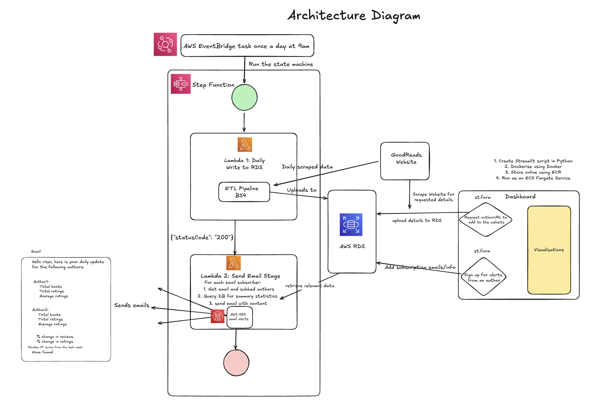

# Book Tracker Project

A project for scraping and visualising data on author and book popularity from a range of websites, designed with publishers in mind.

Data on author and book popularity, including ratings and reviews, are collected once daily. This data is visualised on an interactive dashboard for publishers. Here, new authors can be requested to be tracked, and daily email reports can be requested, containing summary statistics for chosen authors.

Additional information on the project can be found [here](https://docs.google.com/document/d/1ihmuPt68K87EajOhWezTdoZqu7_oyWqp1QZHaR0cIeA/edit?tab=t.0).

---

# Architecture Diagram

