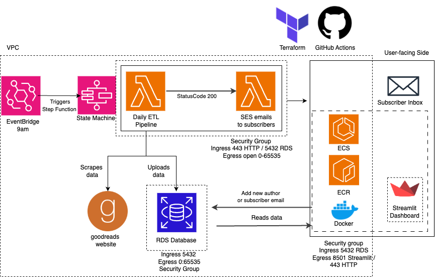

# 📚 Book Project: Author performance tracker

A project for scraping and visualising data on author and book popularity from a range of websites, designed with publishers in mind.

Data on author and book popularity, including ratings and reviews, is collected once daily. This data is visualised on an interactive dashboard for publishers. In the dashboard, new authors can be requested to be tracked, and daily email reports can be requested, containing summary statistics for chosen authors.

Additional information on the project can be found [here](https://docs.google.com/document/d/1ihmuPt68K87EajOhWezTdoZqu7_oyWqp1QZHaR0cIeA/edit?tab=t.0).

## Table of Contents
- [Overview](#overview)
- [Contents](#contents)
- [System Architecture](#system-architecture)

## 📖 Overview
It's a difficult task to track how well authors are performing, especially when important metrics can be scattered across multiple websites. This project will help extract and compile data regarding the performance of authors into one consistent location, which can be used to assist publishers and analysts who may be interested in gaining a better understanding of how specific authors are performing.

This project includes a dashboard that displays key statistics for all authors within the database. Users can add new authors by submitting a link to an author’s [Goodreads profile](https://www.goodreads.com/). Additionally, users can opt into email notifications for any updates on selected authors.

## 🗂️ Contents
Each directory has its own README file containing a deep overview of the purpose of the directory and how to run it for yourself. These directories are provided in order of use to implement this project:

- `database`: Schema setup and data models

- `pipeline`: ETL pipeline including data scraping, transformation, and loading

- `dashboard`: Frontend interface for users (using Streamlit)

- `email`: Scripts for creating and automating email updates 

- `assets`: Images used for architecture, ERD and wireframe diagrams.

## 🤖 Automated testing & linting

Within the `.github/workflows` directory, there are two files `pylinter.yml` and `tester.yml`.
These files, along with the bash scripts in `/scripts/`, create automated actions on any python scripts within a pull request, which run pylint and pytest to ensure high accuracy and quality in the code provided.

# Architecture Diagram

