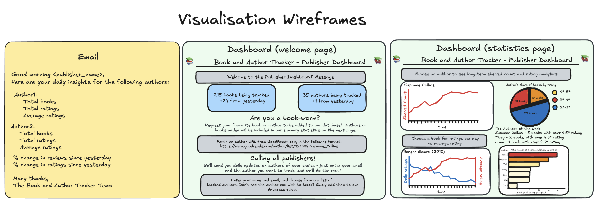

# Folder for dashboard / visualisations
This folder contains a Streamlit dashboard that loads data from the RDS using psycopg2.
To run locally: `streamlit run dashboard.py`.

Also contains sub-folders:

* terraform/

# Dashboard - running locally
## Requirements

To install requirements run:
`pip install -r requirements.txt`

A .env file must contain these variables:

```
DB_HOST=
DB_NAME=
DB_USERNAME=
DB_PASSWORD=
DB_PORT=
```


Dashboard Wireframe:



# Terraform

terraform/ - contains code for storage infrastructure

* main.tf

    * Creates an ECR repository for the dashboard docker image
    * Creates a security group for the dashboard
    * Specifies ingress-egress rules for the security group
    * Creates a CloudWatch log group for the ECS service
    * Creates a ECS task definition
    * Triggers an ECS service based on the task definition
    * Returns the ECR image uri's in the terminal once step 1 from below has finished running.

* variables.tf 

    * allows for environmental variables to be passed into the main file.

* outputs.tf 

    * allows for the image uri's to be returned to the terminal when performing step 1 above

Please setup a third file, `terraform.tfvars`, that specifies environmental variables and follows this format:

```
DB_USERNAME=<your_database_username>
DB_PASSWORD=<your_database_password>
DB_PORT=5432
DB_NAME=<your_database_name>
DB_HOST=<your_database_address>
```

This configuration assumes that AWS CLI has been set up and so AWS keys are not required within the `terraform.tfvars`. If you haven't set up the AWS CLI, you can follow up to step 3 from this [article](https://medium.com/@simonazhangzy/installing-and-configuring-the-aws-cli-7d33796e4a7c) to help you.


## Get started

The Terraform files can be run using the following steps for the first time:

1. Run `terraform init`

2. Once successful, run the commands below to create the ECR repository for the dashboard image:  
    * `terraform apply -target=aws_ecr_repository.c16-book-project-dashboard-ecr`

3. Copy the image uri outputted in the console from step 2 and paste the value into the corresponding variable in the `variables.tf` file

4. Carry out the steps below to add a Docker image to the new ECR repository that has been created under the heading ECR Image.

5. Run `terraform apply` once the previous step is complete to apply the rest of script.

Once the ECR repository has been set up with a Docker image, only step 5 is required to set up the infrastructure from now on.


# ECR Image

## Dockerfile

The `Dockerfile` contains the script to create the Docker image for the dashboard. This is going to be stored inside an ECR repository, where it will run on ECS.

This `Dockerfile` image uses the following files within this directory:
- `requirements.txt` - All requirements for the dashboard script.

- `welcome.py` - the python script which runs the streamlit dashboard. This is to be converted into a Docker image, alongside all scripts inside the `pages` folder.

- `.env` - mentioned at the start of this README, and contains the relevant information to connect to the database.


## Get started

To set up the ECR repository with the Docker image, carry out the following steps after carrying out steps 1 and 2 from the terraform section:


1. Build your docker image by running the command shown below while located in the dashboard directory. The `c16-book-project-dashboard-ecr` statement must be changed to your ECR name if you have specified a different name.

```
docker build -t c16-book-project-dashboard-ecr --platform "linux/amd64" -f Dockerfile .
```

2. Find your AWS ECR repository location on the AWS website


3. Follow step 1, 3 and 4 of the push commands on the AWS console for the relevant ECR repository, found in `View push commands`.

This will push the docker image into your AWS repository, so that it is able to run the desired scripts.

## Run locally

Once you have created the docker image in step 1 above, you can test this docker file locally by running the following command in the dashboard directory:

```
docker run --platform linux/amd64 --env-file .env -p 8501:8501 c16-book-project-dashboard-ecr
```